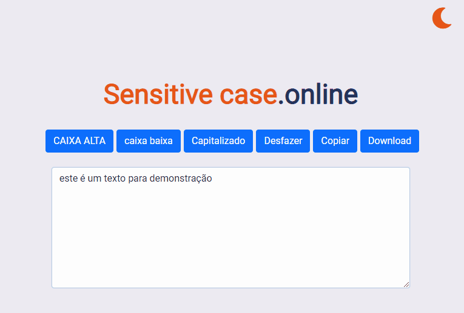

 
<h1 align="center">
  
</h1>

O melhor site para formatar o seus textos

 

  

 

## 📄 **Sobre este projeto**

Este site tem como objetivo ajudar e facilitar o processo de formatar uma frase, um texto ou uma lista na qual precise

 

---
 

## 🚀 Tecnologias

- [html5](https://html5.org/)
- [Css3](https://www.w3.org/Style/CSS/Overview.en.html)
- [JavaScript](https://developer.mozilla.org/pt-BR/docs/Web/JavaScript)

 

---

Feito com 💜 por LEONARDO M. 👋 [veja meu linkedin](https://www.linkedin.com/in/leonardo-muniz-a39984144/)
 

